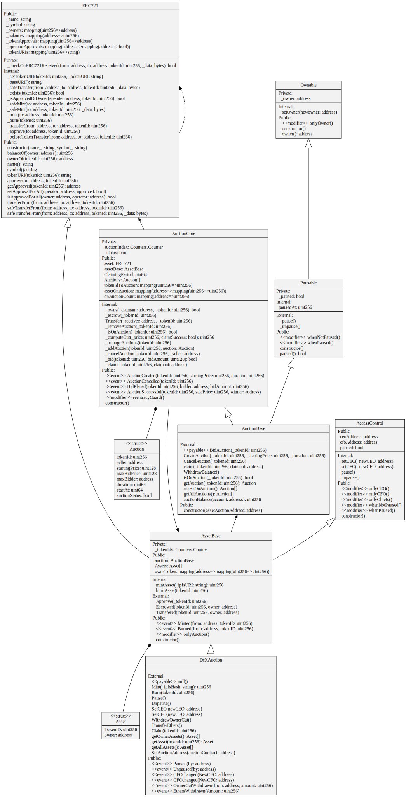

# Dex-Auction

(An NFT marketplace built on Ethereum Blockchain)

## Description

Non-fungible tokens (NFTs) are cryptographic assets on a blockchain with unique identification codes and metadata that distinguish them from each other. Unlike cryptocurrencies, they cannot be traded or exchanged at equivalency. This differs from fungible tokens like cryptocurrencies, which are identical to each other and, therefore, can serve as a medium for commercial transactions.

Blockchain technology and NFTs afford artists and content creators a unique opportunity to monetize their wares. For example, artists no longer have to rely on galleries or auction houses to sell their art. Instead, the artist can sell it directly to the consumer as an NFT, which also lets them keep more of the profits. In addition, artists can program in royalties so they’ll receive a percentage of sales whenever their art is sold to a new owner. This is an attractive feature as artists generally do not receive future proceeds after their art is first sold.

This project does not seek to provide a full coverage of NFT Marketplace but fulfills all major requirements. 

## Tech Stack

**Client:** _React_, _TailwindCSS_, _axios_, _react-router_, _uuid_, _web3modal_

**Server:** _firebase_, ~~IPFS~~

**Blockchain:** _solidity_, _ethers_, _hardhat_, _ethereum-waffle_, _chai_

## Technical Details (PoC)

The section discusses the technical parameters used in the Solidity, the Firebase Storage, and the React front-end.

### Architecture

**Solidity/Ethereum**  
Blockchain as a backend where information about assets and auction details can be stored according to the data and parameters specified. Current implementation uses Smart Contracts seperated according to their functionality.

**React**  
React is the demonstration front-end for login to localhost Blockchain network. Currently it can showcase all NFTs in Homepage, ALlows users to mint their own NFTs, Burn them or put them on Auction And allow others to participate in the Auction.

**Firebase Storage**
Firebase Storage is used for storing NFTs and their respective Metadata. And its metadeta URL is then linked with NFT in blockchain. Currently only uploading and downloading in implemented modifying and deleting is not supported.

### Smart Contract Structure

### UI/UX

